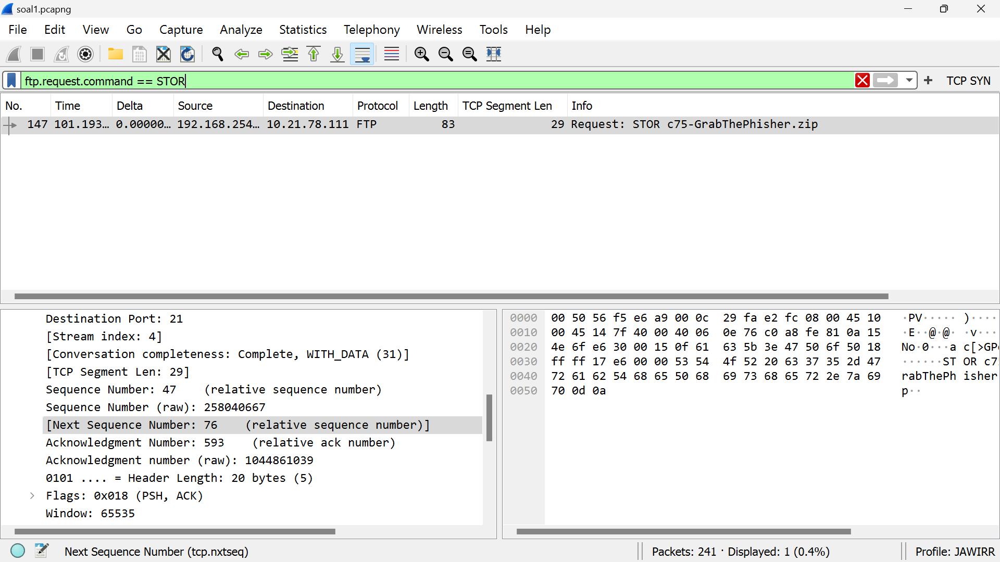
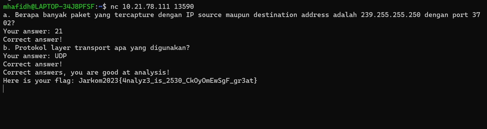
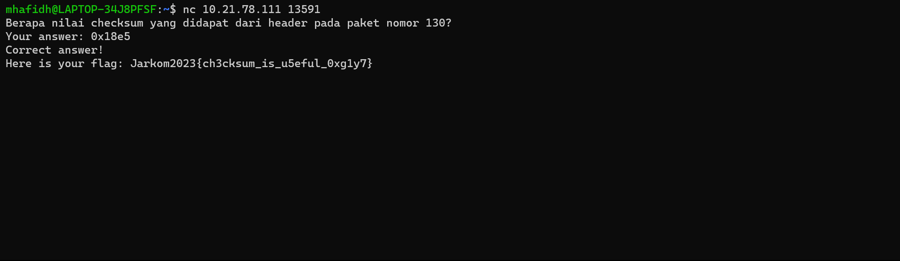
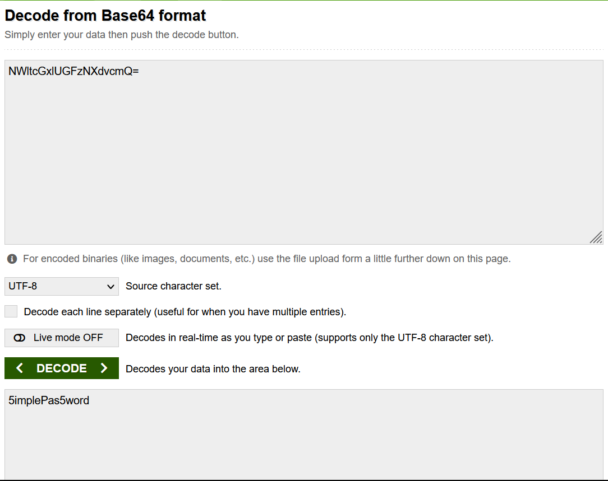
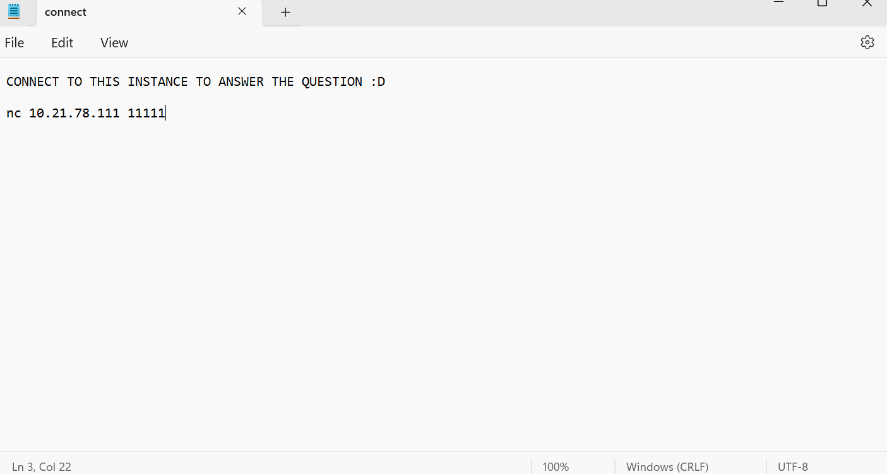

# Jarkom-Modul-1-E06-2023
Berikut adalah repository dari kelompok E06 untuk pengerjaan Praktikum Modul 1 Jaringan Komputer. Repository ini akan berisikan dokumentasi cara pengerjaan tiap soal, screenshot output, dan kendala yang dialami.

# Anggota Kelompok
| Nama | NRP | 
| --- | --- |
| Muhammad Hafidh Rosyadi | 5025211013 |
| Kartika Diva Asmara Gita | 5025211039 |

# Dokumentasi Pengerjaan Soal
## Nomor 1
### Soal
User melakukan berbagai aktivitas dengan menggunakan protokol FTP. Salah satunya adalah mengunggah suatu file.
- Berapakah sequence number (raw) pada packet yang menunjukkan aktivitas tersebut?
- Berapakah acknowledge number (raw) pada packet yang menunjukkan aktivitas tersebut? 
- Berapakah sequence number (raw) pada packet yang menunjukkan response dari aktivitas tersebut?
- Berapakah acknowledge number (raw) pada packet yang menunjukkan response dari aktivitas tersebut?

### Jawaban
- Karena aktivitas menggunakan protocol FTP dan salah satunya adalah mengunggah file maka dapat digunakan filter `ftp.request.command == STOR` dimana STOR merupakan aktivitas untuk mengunggah suatu file.
- Pada bagian Transmission Protocol Control, dapat dilihat nilai sequence number (raw) dan juga acknowledge number (raw).

- Karena Response dari request pasti berdekatan, maka dapat dilakukan filter protocol 'ftp' dan dapat dicari paket setelah paket 147 (paket request). Paket 149 adalah paket setelah 147 dan berisi response, maka itu pasti reponse dari aktivitas mengunggah file.
- Dapat dilihat nilai sequence number (raw) dan juga acknowledge number (raw) dari paket reponse.

- Berikut jawaban dan flag:
  

## Nomor 2
### Soal
Sebutkan web server yang digunakan pada portal praktikum Jaringan Komputer!

### Jawaban
- Karena ip pada platform jarkom adalah 10.21.78.111, maka dilakukan filter `ip.src == 10.21.78.111` untuk mengambil paket yang berasal dari ip tersebut.
  

Selanjutnya klik kanan, follow, dan TCP Stream untuk melihat web server yang digunakan yaitu gunicorn.

Berikut jawaban dan flag:

## Nomor 3
### Soal
Dapin sedang belajar analisis jaringan. Bantulah Dapin untuk mengerjakan soal berikut:
- Berapa banyak paket yang tercapture dengan IP source maupun destination address adalah 239.255.255.250 dengan port 3702?
- Protokol layer transport apa yang digunakan?

### Jawaban
- Dilakukan filter `ip.addr == 239.255.255.250 && (udp.port == 3702 || tcp.port == 3702)` untuk melihat paket ip 239.255.255.250 dan paket dengan port 3702.

- Pada detail bagian diatas, dapat dilihat bawah terdapat 21 paket dengan protokol layer yang digunakan hanya UDP saja.
- Berikut jawaban dan flag:

## Nomor 4
### Soal 
Berapa nilai checksum yang didapat dari header pada paket nomor 130?

### Jawaban
- Mencari paket dengan nomor 130, kemudian lihat detail paket pada bagian Transmission Protocol Control.

Didapatkan nilai Checksum adalah 0x18e5.
Berikut jawaban dan flag:

## Nomor 5
### Soal
Elshe menemukan suatu file packet capture yang menarik. Bantulah Elshe untuk menganalisis file packet capture tersebut.
- Berapa banyak packet yang berhasil di capture dari file pcap tersebut?
- Port berapakah pada server yang digunakan untuk service SMTP?
- Dari semua alamat IP yang tercapture, IP berapakah yang merupakan public IP?

### Jawaban
- Untuk membuka file zip yang diberikan dibutuhkan password, sehingga perlu untuk mencari password dari satu persatu detail paket yang diberikan.

- klik kanan, follow, dan TCP Stream untuk mencari password.
- Dalam pengecekan TCP stream di dalam paket, ditemukan password yaitu NWltcGxlUGFzNXdvcmQ= pada paket nomor 3

- Decode password dengan base64 sesuai dengan arahan.
- Didapatkan password yaitu 5implePas5word untuk mengekstrak zip file.

- Pada zip file terdapat port netcat nc 10.21.78.111 11111.

